# [ColourChange Challenge](https://sarahgoodwin93.github.io/project2-colourchange-challenge/ "Link to Does It Match Webpage")

The ColourChange Challenge is a game to test your speed and reactions.
Users clicks will be counted, the faster they click, the more they will score!

The site will target people wanting a fun easy game to test their reaction time and eye site. Users can come back to the site to try to beat their score.

In the game the boxes will change colour at various speeds depending on the level, users must click on the correct box for it to be counted as a click and for their score to increase. Aim of the game is try to get the biggest number of clicks.

The timer will get faster, the boxes will change quicker and the fun will get greater!

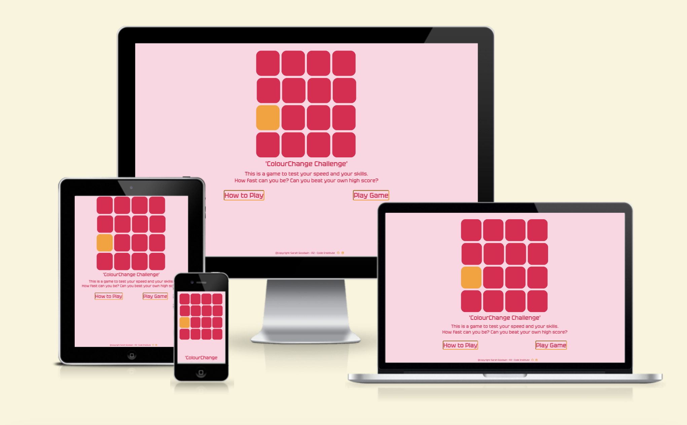

# Table of Contents

- [ColourChange Challenge](#colourchange-challenge)
- [Table of Contents](#table-of-contents)
- [Key Project Goals](#key-project-goals)
  - [Target Audience](#target-audience)
  - [User Stories](#user-stories)
    - [First time users](#first-time-users)
    - [Returning Users](#returning-users)
    - [Reaction Times](#reaction-times)
- [Design](#design)
  - [Colour Scheme](#colour-scheme)
  - [Wire frames](#wire-frames)
  - [Typography](#typography)
- [Features](#features)
  - [Navigation](#navigation)
  - [Hero Image / Logo](#hero-image--logo)
  - [Home](#home)
  - [How to Play](#how-to-play)
  - [Play Game](#play-game)
    - [Timer](#timer)
    - [Game Grid](#game-grid)
    - [Game Buttons](#game-buttons)
      - [Start Button](#start-button)
      - [Next Level](#next-level)
      - [Reset Button](#reset-button)
    - [Score Section](#score-section)
      - [Clicks](#clicks)
      - [Missed Boxews](#missed-boxews)
      - [Total Clicks](#total-clicks)
  - [The Footer](#the-footer)
- [Testing](#testing)
  - [Manual Testing](#manual-testing)
      - [Laptops](#laptops)
      - [Desktop](#desktop)
      - [Mobile](#mobile)
      - [Browsers](#browsers)
  - [Validator Testing](#validator-testing)
    - [W3 - HTML validator](#w3---html-validator)
    - [W3C - CSS Validator](#w3c---css-validator)
    - [JS Hint - Javascript Validator](#js-hint---javascript-validator)
    - [Errors that were found in validator and fixed](#errors-that-were-found-in-validator-and-fixed)
  - [Lighthouse scores](#lighthouse-scores)
  - [Mobile and iPad Testing Comments](#mobile-and-ipad-testing-comments)
  - [Nav Bar Testing Comments](#nav-bar-testing-comments)
  - [Other Testing Comments](#other-testing-comments)
  - [Unfixed Bugs](#unfixed-bugs)
- [Deployment](#deployment)
  - [Deploying on GitHub Pages](#deploying-on-github-pages)
- [Technologies Used](#technologies-used)
- [Future Features to Implement](#future-features-to-implement)
- [Credits](#credits)
  - [Content](#content)
    - [Images](#images)
- [Education](#education)
  - [Game Inspiration](#game-inspiration)

# Key Project Goals

- Provide easy navigation for users across all pages of the site
- Provide a fun interactive game for users to test their visual reaction time and hand eye coordination
- Provide easy to understand instructions so that users know how to play the game

## Target Audience

The target audience for this website is

- First time users
- Returning users
- People wanting to improve reaction time

## User Stories

### First time users

1. As a first time user I want clear game instrcutions with easy game play.
2. As a first time user I want to be able to navigate the site quickly and easily.
3. As a first time user I want to be able to see my scores increase to proivde motivation in the game.

### Returning Users

1. As a returning time user I want to be able to get better at the game and increase my scores.
2. As a returning time user I want to be able to get in contact with the site creator in case I have questions
3. As a returning time user I want have fun playing the game to improve my reaction times.

### Reaction Times

1. As someone who wishes to improve their reaction time I want to be able to clearly see the timer so I can try to get as many clicks as possible within the timeframe
2. As someone who wishes to improve their reaction time I want to be able to clearly see my scores increase and know when I have missed a box.
3. As someone who wishes to improve their reaction time I want to see if new levels have been added so I can try to continue to improve.

# Design

## Colour Scheme

The colour scheme was chosen to look like a retro game, bright bold and vibrant colours were chosen for the logo and buttons - {#e7014c}, {#ff9e1d}.

A pastel background was chosen to make the main colours pop, {#ffd5e2}

Within the boxes the colours are also pastel to show a stark difference between the main pink - {#e7014c}.
These colours were chosen from [Visme](https://visme.co/blog/pastel-colors/ "link to visme website")

## Wire frames

A wireframe was made to flesh out the design and strucutre of the site and visualise user expereince. Wireframe were created using [figma](https://www.figma.com/?fuid= "link to figma homepage")

To expand the wireframes please click here

Wireframe Home Page

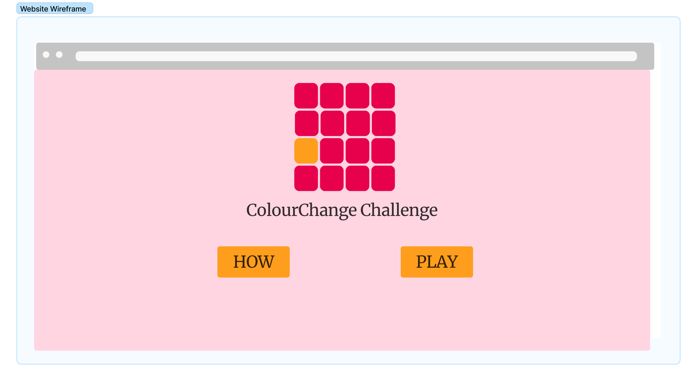

Wireframe How to Play Page

Wireframe Play Game Page

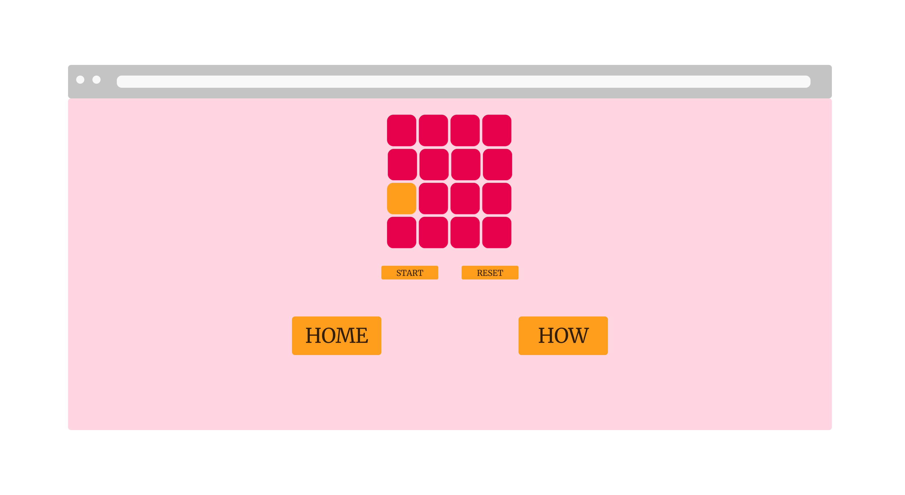

## Typography

The font [Tektur](https://fonts.google.com/specimen/Tektur "link to Tektur google font") was used throughout the side to give it a arcade game type feel. It's octagonal outlines and rectangular style fit within the retro design for the game.

Sans-Serif has been applied as a back-up in case of import failure.

# Features

## Navigation

Each page has 2 navigation buttons to take you to the other pages, they are all places towards the bottom of the screen to allow continuity for the user expereince.

If you are on the 'Homepage', you will see the buttons for 'How to Play' and 'Play Game'
If you are on the 'How to Play' page, you will see the buttons for 'Homepage' and 'Play Game'
If you are on the 'Play Game' page, you will see the buttons for 'Homepage' and 'How to Play'

Therefore whichever page button is lacking, shows you which page you are on.

## Hero Image / Logo

The logo of the ColourChange Challenge shows an example of the game while using the sites 2 main colours - {#e7014c}, {#ff9e1d}.

It allows users to know straight away they will be doing a challenge with a grid and colours, and the bright colours draw users in and create an excitement to the page.

Because the logo and the game grid are of similar size it allows for continuity in the user experience, almost like you are playing as soon as you enter the site!

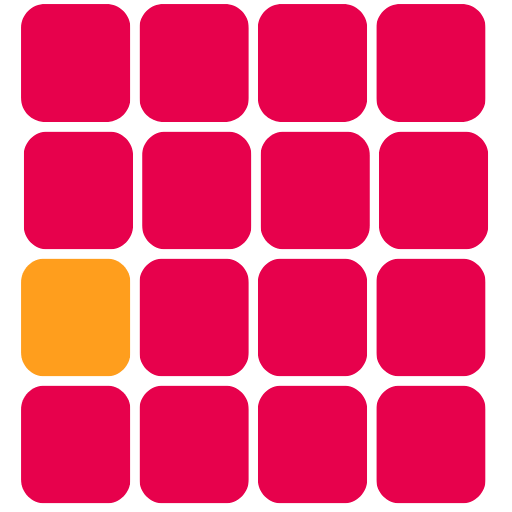

## Home

The homepage is a simple design offering a large logo image of the game grid, an enticing description about the game and two large navigation buttons for the instrctions and the game.

A simple design was chosen so that users have a clear action path, either to read the game instrctuion or to so straight to the game play.

It is responsive on both desktop and mobile.

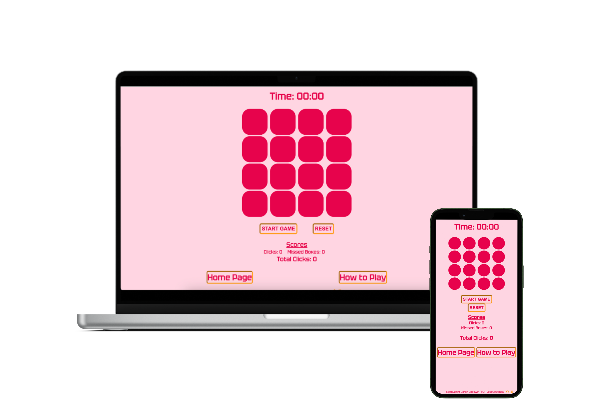

## How to Play

The How to play page has the game instructions, as well as navigation buttons for the home and game pages.
The theme of the boxes has been added to the page to keep design continuity, while added a different look to the logo and game grid. In the static box image you can see one of the boxes is a different shade of pink to the main {#e7014c} colour, which gives an insight into future levels of the game.

The instructions outline the rules of the game, how to play and what to watch out for.

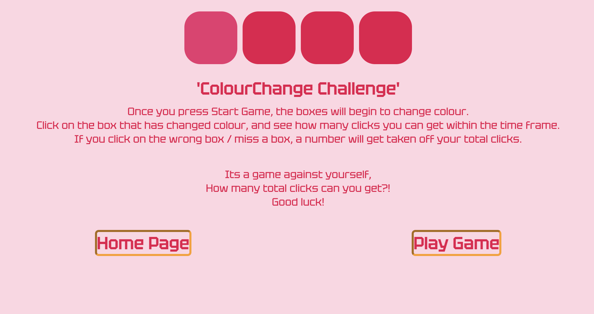

The game is a game of skill and speed which a user is trying to beat their own total clicks high score.
It is responsive on both desktop and mobile.

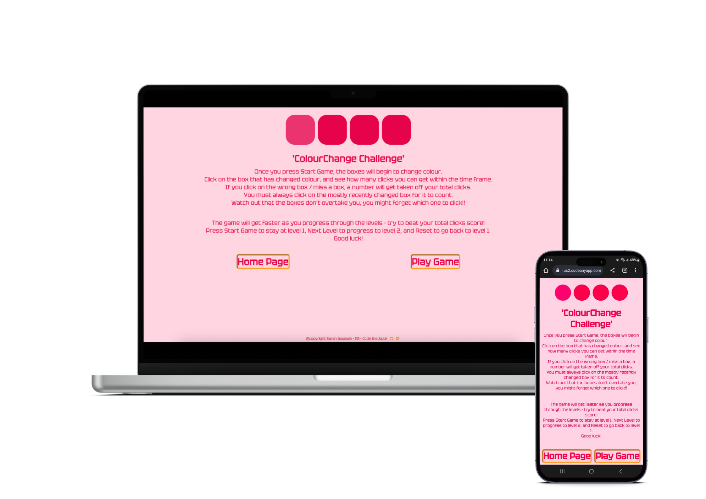

## Play Game

The game grid is where the game is played, the user is playing against their own skills and a timer. They will see their scores increase in the score section.

### Timer

The timer currently has 2 settings, 10 seconds for level 1 and 20 seconds for level 2.
It starts at 00:00 so that the user knows the game has not yet begun.

### Game Grid

The boxes will begin to change colour once the user presses {Start Game} or {Next Level}. The boxes will change a different speeds depending on the level, and run for a different duration depending on the timer.
The boxes run through the specified array of colours to keep in theme of the design colours.

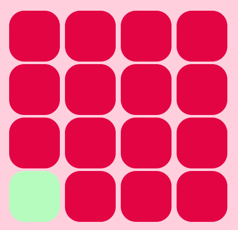

If the user clicks on the correct box, the number of clicks will increase, as will the total clicks.

If i user clicks on the wrong box the alert will appear to let them know that they will need to click on the next box to keep the game going. A number will be taken off the total clicks if the user misses a box.

### Game Buttons

There are 3 buttons within the game.

- Start Button
- Next Level
- Reset

#### Start Button

The Start Game Button begins the game one level 1. This will take the user though the changing boxes for 10 seconds at a rate of 2 seconds between colour changes. The Start Game button also resets the total clicks o that the user can begin a new game to try to beat their previous score.

#### Next Level

The Next Level button brings the user to level 2 where the boxes change at a much quicker rate of 700 milliseconds and the timer duration increased to 20 seconds for a longer game time.
The Next Level button also clears the total clicks so that the user can try to beat their score.

#### Reset Button

The Reset button is there to be used during the game if the user wants to begin again halfway through the game play. It will take the grid back to pink squares and reset the timer to 00:00.
The Reset button does not reset the total clicks as this is done within the Start Game Button and Next Level buttons.

### Score Section

The Score section has 3 features

- Clicks
- Missed Boxes
- Total Clicks

#### Clicks

The clicks are counted every time a user clicks on the correct box.

#### Missed Boxews

Missed Boxes are counted here every time a user clicks on the wrong box and recieves the alert

#### Total Clicks

The total clicks are calculated by minusing the missed boxes from the clicks. The aim of the game is to get the most total clicks you can, and then try to beat your score as you get better at the game.
The total clicks do not disappear once the game is over so that users can see how many they got in total during the game.
The total clicks will go back to 0 once a new game is started by either pressing the Start Game button for the Next Level button.

The Game Grid is responsive on both desktop and mobile.

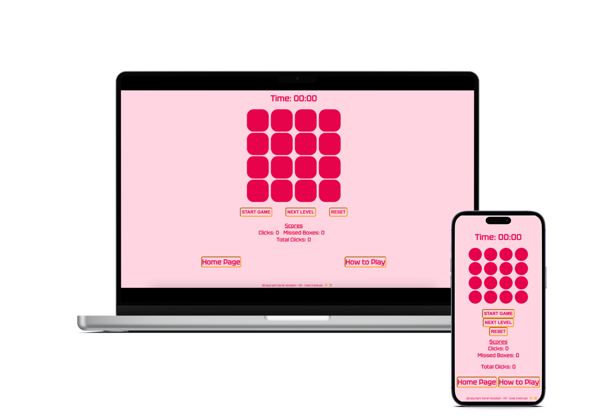

## The Footer

The footer shows who made the game, Sarah Goodwin, that it is copywritted and that it is part of Project 2 for the Codi Institute.

It also has links to Sarah's Github and Linkedin profiles should you wish to contact her

# Testing

## Manual Testing

Manual testing was carried out on every page and with every link.

The ColourChange Challenge site was tested on the following devices:

#### Laptops

- Macbook Air

#### Desktop

- iMac

#### Mobile

- Samsung 22 Ultra (Android)
- iPhone SE (Apple)
- iPhone 12 Mini (Apple)

#### Browsers

- Google Chrome
- Safari
- Firefox

## Validator Testing

### W3 - HTML validator

HTML - Please see screenshots for each page

Homepage

How To Play Page

Play Game Page

### W3C - CSS Validator

CSS - Please see screenshot of CSS Jigsaw validator

### JS Hint - Javascript Validator

Javascript - Please see screenshot of JS Hint validator

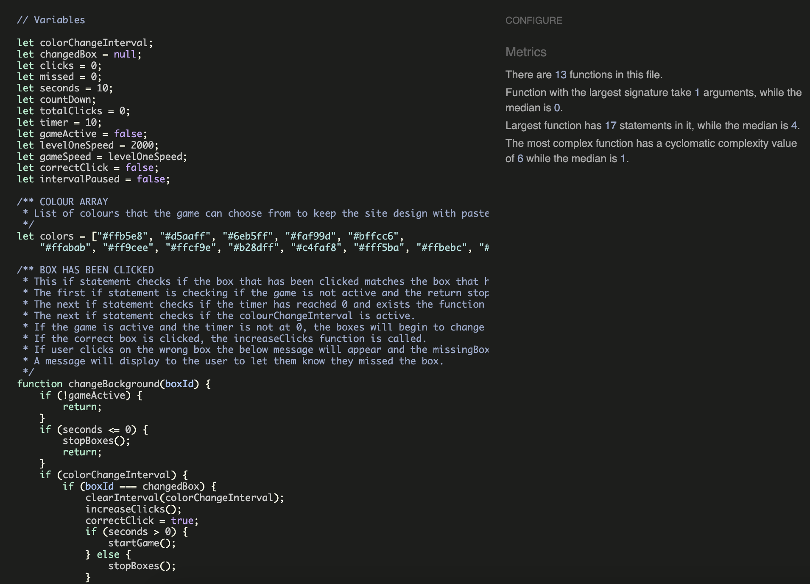

### Errors that were found in validator and fixed

- Warning - Consider using the h1 element as a top-level heading only
- Missing px one .box class

## Lighthouse scores

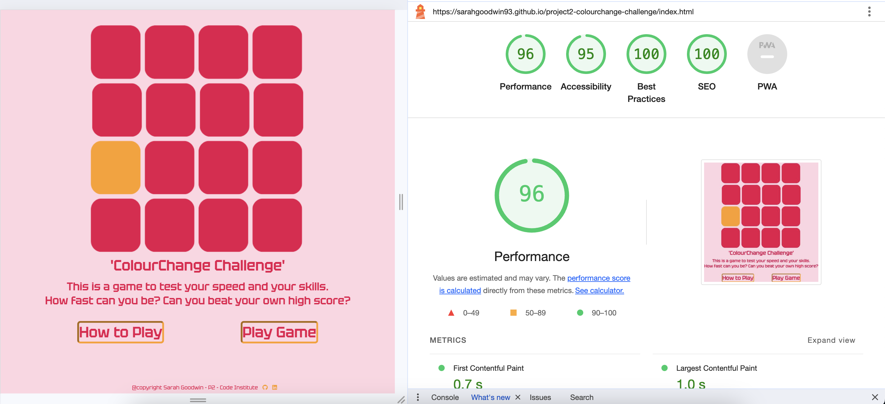

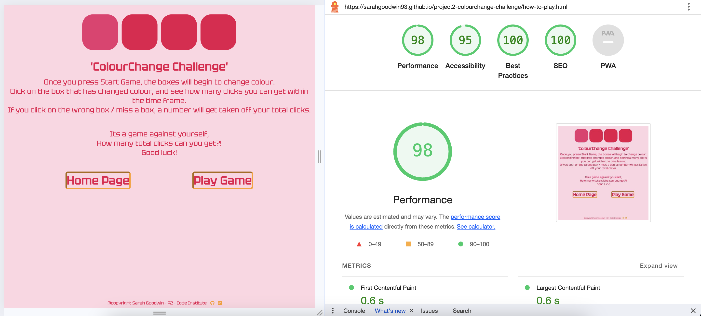

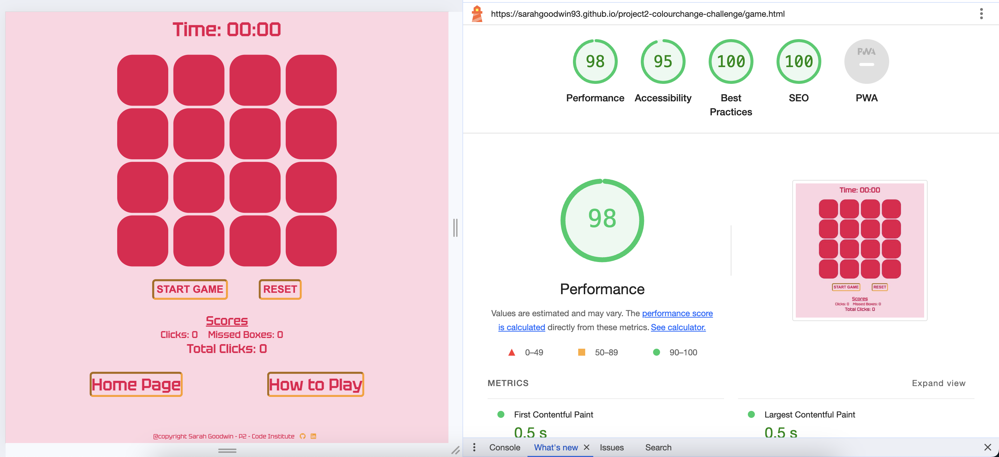

## Mobile and iPad Testing Comments

| **TEST**                  | **ACTION**                            | **EXPECTATION**                      | **RESULT**          | **FIX**                           |
| ------------------------- | ------------------------------------- | ------------------------------------ | ------------------- | --------------------------------- |
| Home page (mobile)        | Samsung 22 Ultra Android              | Elements look good on android        | Works as expected   | N/A                               |
| How to play page (mobile) | Samsung 22 Ultra Android              | Elements look good on android        | Works as expected   | N/A                               |
| Play Game (mobile)        | Samsung 22 Ultra Android              | Game buttons looked off / unfinished | Design not complete | Media query to stack game buttons |
| Home page (ipad)          | Size to 1024px using Chrome Dev Tools | Elements look good on ipad           | Works as expected   | N/A                               |
| How to play page (ipad)   | Size to 1024px using Chrome Dev Tools | Elements look good on ipad           | Works as expected   | N/A                               |
| Play Game (ipad)          | Size to 1024px using Chrome Dev Tools | Elements look good on ipad           | Works as expected   | N/A                               |

## Nav Bar Testing Comments

| **TEST**                  | **ACTION**        | **EXPECTATION**                                            | **RESULT**        | **FIX** |
| ------------------------- | ----------------- | ---------------------------------------------------------- | ----------------- | ------- |
| Nav Buttons - home        | Click nav buttons | That each nav element takes me to the correct page on site | Works as expected | N/A     |
| Nav Butotns - how to play | Click nav buttons | That each nav element takes me to the correct page on site | Works as expected | N/A     |
| Nav Buttons - play game   | Click nav buttons | That each nav element takes me to the correct page on site | Works as expected | N/A     |

## Other Testing Comments

| **TEST**          | **ACTION**                    | **EXPECTATION**                           | **RESULT**         | **FIX** |
| ----------------- | ----------------------------- | ----------------------------------------- | ------------------ | ------- |
| Footer            | Clicked on linkedin button    | Took me to Sarah Goodwin linkedin profile | Worked as expected | N/A     |
| Footer            | Clicked on Github button      | Took me to Sarah Goodwin github page      | Worked as expected | N/A     |
| Start Game button | Clicked on button             | Game started on level 1 speed             | Worked as expected | N/A     |
| Next Level button | Clicked on button             | Game started on level 2 speed             | Worked as expected | N/A     |
| Reset button      | Clicked on button during game | Game reset to beginning                   | Worked as expected | N/A     |

## Unfixed Bugs

No bugs to report

# Deployment

This project was developed using [Codeanywhere](https://app.codeanywhere.com/ "Link to Codeanywhere login"), which was then committed and pushed to GitHub using the Codeanywehere terminals.

## Deploying on GitHub Pages

To deploy this page to GitHub Pages from its Codeanywhere repository, the following steps were taken:

1. Log into [GitHub](https://github.com/login "Link to GitHub login page") or [create an account](https://github.com/join "Link to GitHub create account page").
2. Create repository from [ci template]("<https://github.com/Code-Institute-Org/ci-full-template> "ci template webpage") on github
3. Copy the repo url and copy into [Codeanywhere](https://app.codeanywhere.com/ "Link to Codeanywhere webpage") to create a new workspace
4. Close README tab and create first file named index.html
5. Press ! TAB to create <!DOCTYPE html>
6. Open terminal, type (git add .) (git commit -m "initial commit") (git push)
7. Locate the [GitHub Repository](https://github.com/sarahgoodwin93/project2-colourchange-challenge "Link to The ColourChange Challenge") for ColourChange Challenge.
8. At the top of the repository, select Settings from the menu items.
9. On the side bar menu under 'Code and automation', click on "Pages"
10. Change 'Branch' from "None" to "main", press 'Save'
11. Once saved, wait a few minutes for page to deploy
12. Navigate back to "Pages" and here you will find your deployed link.

The live link can be found here [ColourChange Challenge](https://sarahgoodwin93.github.io/project2-colourchange-challenge/index.html "Link to deployed ColourChange Challenge")

# Technologies Used

- [HTML5](https://en.wikipedia.org/wiki/HTML5 "Link to HTML5 wikipedia")
- [CSS3](https://en.wikipedia.org/wiki/CSS "Link to CSS3 wikipedia")
- [Javascript](https://en.wikipedia.org/wiki/JavaScript "link to Javascript wikipedia")
- [Google Fonts](https://fonts.google.com/ "Link to Google Fonts webpage")
- [Codeanywhere](https://app.codeanywhere.com/ "Link to Codeanywhere webpage")
  GitPod was used for writing code, adding, commiting and pushing to github
- [GitHub](https://github.com/ "Link to GitHub webpage")
  GitHub was used to store the code files, README files and asset files after pushing
- [Figma](https://www.figma.com/?fuid= "link to figma homepage")
  Figma was used for the wireframes
- [Canva](https://www.canva.com/en_gb/login/ "Link to Canva webpage")
  Canva Pro was used to create images for the site
- [Am I Responsive?](https://ui.dev/amiresponsive "Link to Am I responsive webpage")
  Am I Responsive was used in order to see responsive design and create screenshots of the final page on different devices.

# Future Features to Implement

In the future there will be more levels of varying difficult.

A future level will involve the colours becoming more difficult to differentiate between the game grid and the changed colour.

Other future features may include

- Ability for users to choose their game length time
- Ability for users to pick their game speed
- Ability for users to keep their high scores in the game through a login feature
- Ability for users to play their friends and try to beat their scores

# Credits

## Content

Wording for the site was all created by Sarah Goodwin

### Images

Images and logos for the site were all created by Sarah Goodwin using Canva Pro

# Education

The following sites assisted in learning more about the code that was being written, to gain a better understanding of how to best write the code and to get inspiration for the game.

- [Stack Overflow](https://stackoverflow.com/ "Link to Stack Overflow webpage")
  Stack overflow was used to answer questions as to why certain code may not be performing as expected
  A questions was asked on stackover flow for get assistance for the game
  [Stopping a function after a timer has stopped](https://stackoverflow.com/questions/76862262/stopping-a-function-after-a-timer-has-stopped "Link to questions asked on stack overflow")

- [W3Schools](https://www.w3schools.com/ "Link to W3Schools webpage")
  W3Schools was used to gain a better understanding of css styles and how to apply them
  Specifcily these two pages were used when creating the timer
  [JavaScript Timing Events](https://www.w3schools.com/js/js_timing.asp "link to JavaScript Timing Events w3schools")
  [JavaScript Countdown Timer](https://www.w3schools.com/howto/howto_js_countdown.asp "link to JavaScript Timing Events w3schools")
- [Love Maths](https://github.com/sarahgoodwin93/love-maths "link to Love Maths page")
  Love Maths was used as part of the education process and was referred back to to gain ideas for the game set up

- [ChatGPT](https://openai.com/blog/chatgpt "link to chatgpt page")
  ChatGPT was used gain a better understanding of javascript functions

- [CluelessBiker/mentoring](https://github.com/CluelessBiker/mentoring "link to CluesslessBiker repo")
  CluelessBiker mentoring github page was used to check examples of projects, access links to resources such as validators and w3schools, Am I Responsive.

- Comparative Programming Languages Essentials & JavaScript Essentials Code Insititue Modules
  The modules notes that Sarah Goodwin took for the Comparative Programming & JavaScript Essentials sections were referred back to to write code

## Game Inspiration

- The ['Memento'](https://andreeeasn.github.io/pp2-memento/ "link to memento game page") exmaple project was referred for game inspiration and for how to set out javascript syntax

- The [Reaction Time Test Game](https://www.youtube.com/watch?v=8rXj6q0AAkk "link to youtube video for Reaction Time Test Game") youtube video was used for inspriation for a game that changes with user clicks.

- The Handling DOM Events lessons in the JavaScript & the DOM section of the course were particually helpful when creating the game and the functions needed to make the divs change colour.

- Mentor, Lauren-Nicole, for all her help and support, the useful resources she provided and for being a friendly face throughout! Could not have done this project without her!!
